# A2SR
This is the official implementation of our bachelor's degree final year project and thesis named **"A2SR - Advanced Autonomous Security Robot"** in **2020-21**. This project was developed at the **[Khwaja Fareed University of Engineering and Information Technology (KFUEIT)](https://kfueit.edu.pk/)**, in the context of the Bachelor of Science in Information Technology (BSIT).

## A2SR - Advanced Autonomous Security Robot
A2SR is a 3D printed autonomous humanoid robot’s surveillance system with the abilities of interaction with incoming people, their identification, monitoring, and enforcing the security of an environment where the only authentic person can enter along with COVID-19 precaution services by sanitization, face mask and body temperature detection. In A2SR, face recognition is implemented using the FaceNet pre-trained deep learning model and transfer learning applied on MobileNetV2 for face mask detection. To demonstrate and ensure the practicality and performance of A2SR, deployed it on the main entrance of the university to identify and welcome the coming persons along maintaining COVID-19 SOPs with friendly interaction. 

## Project Concept Art ([Video](https://youtu.be/tX6BxuxguuA?si=ivHfyN-88YH6L7Ni))
[](https://youtu.be/tX6BxuxguuA?si=ivHfyN-88YH6L7Ni)

## Project Demo ([Video](https://youtu.be/sIa1a3OgeY0))

## Methodology
The development methodology of the A2SR project is divided into two main parts: Software System Design and Hardware System Design.

### Software System Design
The software system design pipeline consists of several stages:

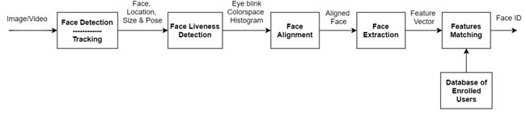
<p align="center">Software System Design</p>

1. **Face Detection:** Utilizes the [MTCNN (Multi-task Cascaded Convolutional Neural Network)](https://github.com/kpzhang93/MTCNN_face_detection_alignment) for face detection, resizing, cropping, and alignment. MTCNN uses three convolutional networks to detect face bounding boxes and landmark locations such as eyes, nose, and lips. 

    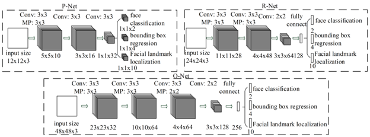
    <p align="center">MTCNN Structure</p>

2. **Liveness Detection:** Implements an extra security layer for face recognition to detect presentation or spoofing attacks. This is achieved through eyes blink detection using landmarks detection and color space histogram concatenation approaches. 
    
    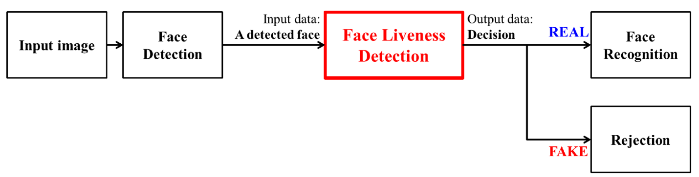
    <p align="center">Liveness Detection</p>
   
3. **Face Recognition:** Utilizes the [FaceNet](https://arxiv.org/abs/1503.03832) model, a deep convolutional network built by Google, for face recognition. The model directly maps face images into embeddings using Euclidean space, where distances correspond to similarities of faces. We collected face images of students and staff members and dataset by performing some preprocessing using MTCNN like face detection, face cropping, face aligning and removing blur faces. Then, we used the FaceNet model on the collected dataset to generate embeddings for each face and trained a classifier to recognize the faces. 
    
   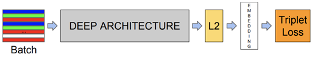
   <p align="center">FaceNet Architecture</p>

   <br>
   
   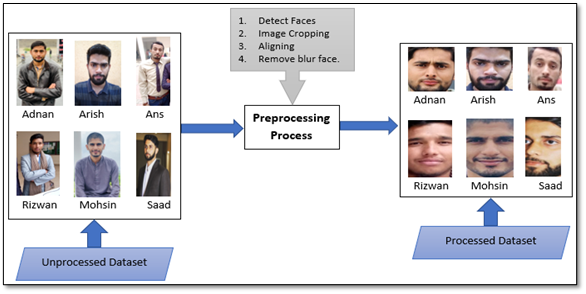
   <p align="center">Dataset Preparation and Preprocessing</p>

   <br>
   
   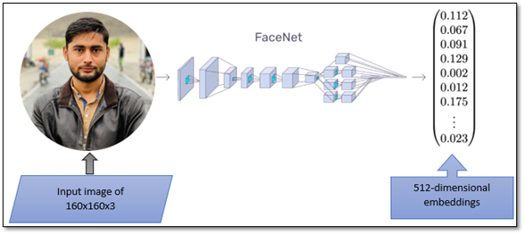
   <p align="center">Face Features Extraction (Embeddings)</p>

   <br>
   
   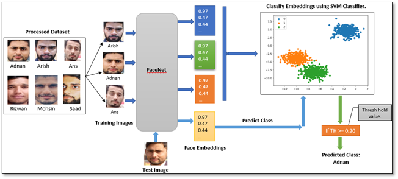
   <p align="center">Features (Embeddings) Classification with SVM</p>
   <br>
   
4. **Face Mask Detection:** Implements face mask detection using transfer learning on the MobileNetV2 pre-trained model. Image augmentation techniques are used for data augmentation, and the model is fine-tuned to classify individuals as wearing a mask or not. 

   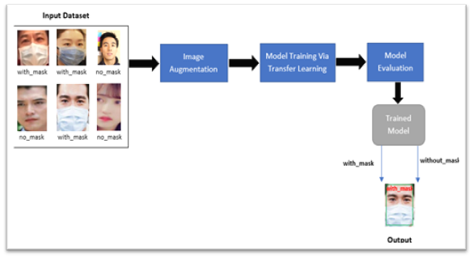
   <p align="center">Schematic representation of the module training</p>
   <br>
   
5. **Friendly Interaction:** Implements friendly interaction using head, arms, and jaws movements, along with voice assistance using text-to-speech mechanisms. 
6. **Temperature Detection:** Utilizes the Infrared Thermometer MLX90614 to detect a person's body temperature. The infrared thermometer measures temperature by calculating the infrared rays emitted by the person's body. 
7. **Hands Sanitization:** Incorporates a hands sanitization module where the robot dispenses sanitizer when a person's hands are detected nearby.

### Hardware System Design
The hardware system design pipeline consists of several stages:
1. **3D Modeling:** Utilizes the open-source [InMoov](https://inmoov.fr/?doing_wp_cron=1709488017.4531919956207275390625) 3D printed robot model for the robot's body and head. The InMoov model is a life-sized humanoid robot designed by Gael Langevin.
2. **3D Printing:** Utilizes a 3D printer to print the InMoov model's parts. The 3D printer uses PLA (Polylactic Acid) filament to print the micro-sized parts of the robot's body and head.
3. **Electronics:** **Arduino Mega 2560** microcontroller to control the servo motors based on signals received from Python code; **Nvidia Jetson TX2 board** as a computing unit for all deep learning models, backend and run software system; and various sensors and actuators for the robot's electronics system such as servo motors, **ultrasonic sensors**, **infrared sensors**, and a hands sanitization module.
   <br>
   <p float="center">
      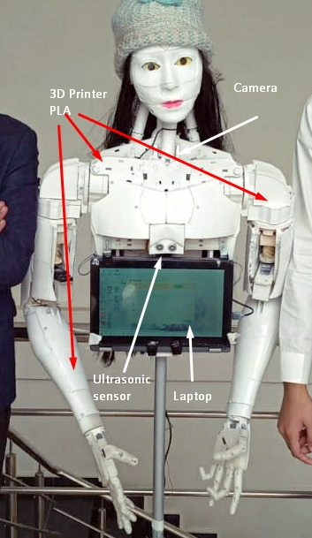 
      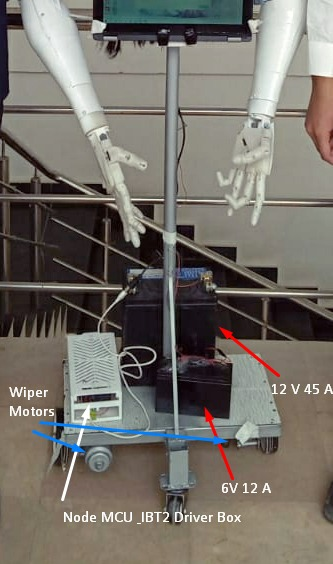
   </p>
   <p align="center">Electronics Components</p>
   <br>
5. **Assembly:** Assembles the 3D printed parts and electronics to build the robot's body and head. The robot's body and head are assembled using screws and nuts, and the electronics are connected to the robot's body and head using jumper wires and connectors.
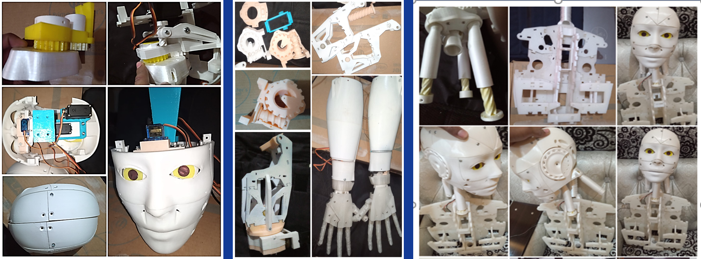
<p align="center">A2SR printed parts and their assembly</p>

## Dependencies
- Python 3.7
- Install the required packages using the following command:
  ```bash
  pip install -r requirements.txt
  ```
  
## Conclusion and Future Work
In conclusion, the A2SR project successfully developed a humanoid security robot capable of facial recognition, face mask detection, and friendly interaction. The system demonstrated robust performance in real-world scenarios and can be used for various applications, including attendance systems and security enforcement.

Future work includes improving the system's performance in different lighting conditions, enhancing the liveness detection module, and exploring solutions for facial recognition on masked faces post-COVID-19. Additionally, the project aims to optimize performance by implementing functionalities on Jetson TX2 for faster processing.

## License
This project is licensed under the MIT License - see the [LICENSE](LICENSE) file for details.


